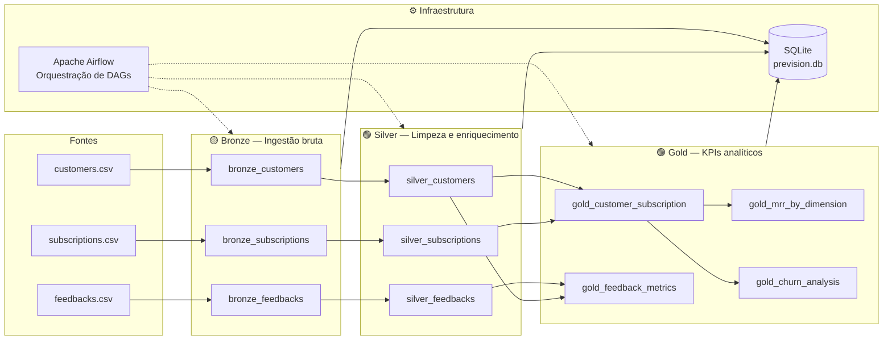
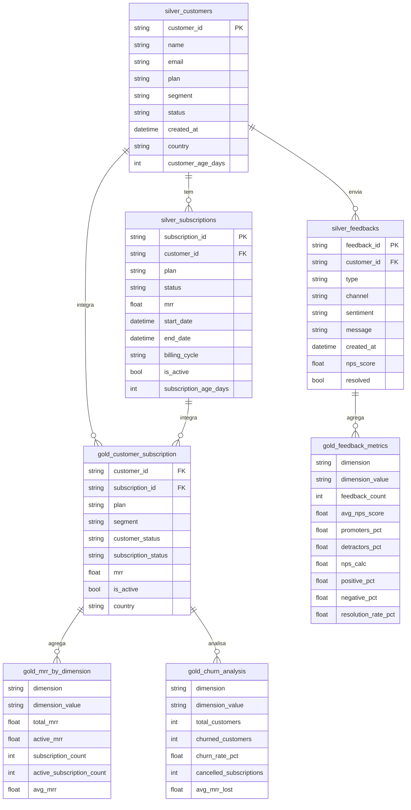

# Arquitetura e Modelo de Dados

## Arquitetura do Pipeline



**Fluxo de execução das DAGs:**

```
bronze_customers ──┐
bronze_subscriptions ──┼──► silver_gold_transform
bronze_feedbacks ──┘

Cada DAG bronze executa:
  validate_source → load_to_bronze → validate_bronze
```

---

## Modelo de Dados


